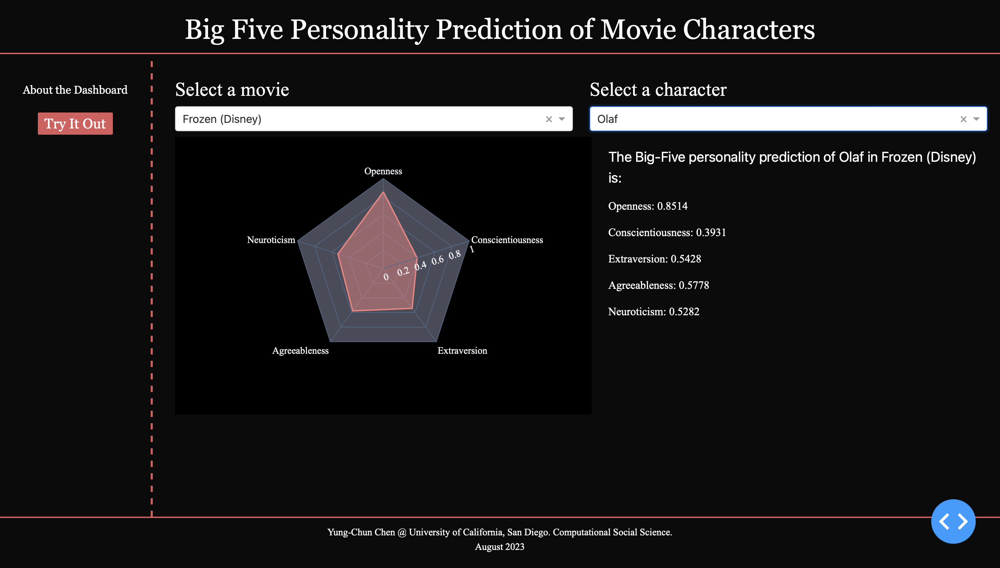

# Big-Five-Personality-Prediction-of-Movie-Characters

## Data Collection
- Labeled data: `essays.csv` ([Pennebaker & King 1999](https://web.archive.org/web/20160519045708/http:/mypersonality.org/wiki/doku.php?id=wcpr13))
- Unlabeled data (movie scripts): [Internet Movie Database](https://www.imdb.com)
  - Web crawler developed by Saha, Aveek
  @misc{Saha_Movie_Script_Database_2021,
  author = {Saha, Aveek},
  month = {7},
  title = {{Movie Script Database}},
  url = {https://github.com/Aveek-Saha/Movie-Script-Database},
   year = {2021} }

## Data Cleansing
- Training & predicting data
  - Removed punctuations, numbers, non-sense words, stop words, and made them lower
- Predicting data
  - Found main characters: characters whose number of lines exceeds the 95th percentile.
  - Applied text-embedding-ada-002 transforming model from OpenAI
  - Dropped files < 5mb
 
## Modeling
- The model is based on an SVM classifier. Each trait of the Big Five personality was trained separately.

## Dashboard
- [Big Five Personality Prediction of Movie Characters](https://big-five-personality-prediction-of-movie-cpc2.onrender.com)
  - It might take a minute for the website to load.

 

